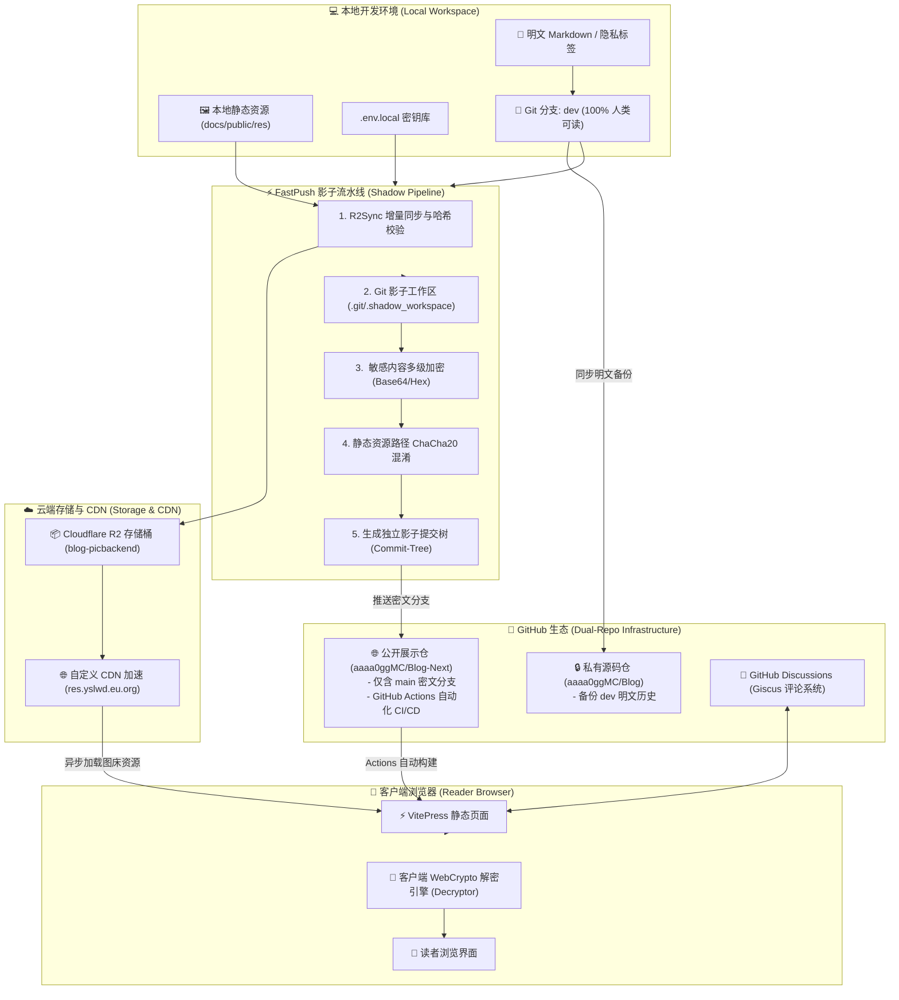

# aaaa0ggmc's Blog 🚀

> **记录生活 · 勿忘我 (Forget Me Not)**  
> 个人现代化静态博客系统，基于 **VitePress**、**Cloudflare R2** 与 **端到端影子加密双仓体系** 构建。  
> 
> 🌐 **在线站点**：[https://yslwd.eu.org](https://yslwd.eu.org)

---

## 🏗️ 核心架构全景 (System Architecture)

本博客采用**双仓分离 + 影子安全流水线 + 云端对象存储 + 客户端端到端解密**的企业级隐私与发布架构：



---

## 🌟 核心设计与特性

### 1. 🛡️ 双仓分离与影子安全推送 (Dual-Repo & Shadow Push)
为了同时兼顾 **“本地明文顺畅编写”** 与 **“公开仓库零敏感泄露”**：
- **私有仓库 (`Blog`)**：仅自己可见，存储完整的明文开发历史（`dev` 分支）、未加密资源与本地环境配置。
- **公开仓库 (`Blog-Next`)**：面向公众展示，仅包含加密后的安全分支（`main`），历史 commit 隔离，不留任何敏感痕迹。
- **Shadow Push 机制 (`fastpush.sh`)**：
  - 基于 Git 底层 Plumbing 命令（`git read-tree`、`git write-tree`、`git commit-tree`）在 `.git` 内创建隔离的内存/影子工作区；
  - 自动完成内容加密与路径混淆，并在不脏化本地任何工作区文件的前提下，生成密文 Commit 并直接推送到公开仓库。

### 2. 🔐 端到端多级加解密体系
- **文章级隐私标签 (`<ec>`)**：支持对 Markdown 内的特定段落、敏感日志进行加密（支持 GPG Key、Private Key、Teacher Key 及用户自定义密码）。
- **客户端实时解密 (`Decryptor.vue` & `crypto.ts`)**：
  - 页面加载时以优雅的磨砂占位符呈现密文；
  - 读者输入密码或私钥后，由浏览器 Web Crypto API / CryptoJS 本地解密并即时渲染，支持解密状态缓存。

### 3. 📦 静态资产流水线与路径混淆 (Asset & CDN Pipeline)
- **Cloudflare R2 增量同步 (`res-sync.mjs`)**：
  - 自动扫描本地大图、音频等资源，计算 SHA-256 校验和，仅增量上传新增或修改的文件，自动维护 `.res_manifest.json` 元数据清单。
- **ChaCha20 路径混淆 (`path-crypto.mjs`)**：
  - 构建发布时，所有静态资源路径均被加密为无规律的哈希路径（如 `/v1_x8F9...jpg`），防止通过公开仓库结构或目录字典嗅探私人生活相册。
- **双模动态切换 (`resTransformPlugin.ts` & `SelectiveIniter.ts`)**：
  - 本地 `pnpm dev` 自动读取本地明文文件；线上生产构建自动重定向至高带宽 CDN。

### 4. 🎨 深度定制的 VitePress 主题
- **时段感知动态主页 (`HomePage.vue` & `homePeriods.ts`)**：主页背景与氛围光随现实一天中的时间段（清晨、正午、黄昏、子夜等）动态渐变切换，并支持时钟指针交互微调。
- **定制化排版**：预载并集成精美中文字体（**仓耳今楷**），支持数学公式 KaTeX/MathJax、全图灯箱浏览 (`ImageViewer.vue`)、文章字数与阅读时长统计 (`ArticleMeta.vue`)。
- **互动社区**：集成 **Giscus**（基于 GitHub Discussions 的无服务器无后端评论系统）。

---

## 📁 目录结构概览

```text
.
├── docs/                        # 博客内容根目录
│   ├── .vitepress/              # VitePress 核心配置与主题定制
│   │   ├── config.mts           # 站点核心配置 (导航、插件、Base)
│   │   ├── theme/               # 自定义主题布局、组件与样式
│   │   │   ├── components/      # ArticleMeta, Decryptor, ImageViewer, etc.
│   │   │   ├── layouts/         # Layout.vue (集成 Giscus), HomePage.vue
│   │   │   └── constants/       # homePeriods.ts 等时段常量
│   │   └── scripts/             # 侧边栏自动生成、资源路径解析、加解密核心
│   ├── public/                  # 静态公共资源与 R2 本地映射库
│   ├── writings/                # 随笔与长文
│   ├── notes/                   # 随记与日常日志
│   ├── keep_learning/           # 学习笔记与技术积累
│   ├── exploration/             # 旅途见闻与游记
│   └── gaming_life/             # 游戏记录与生活杂谈
├── scripts/                     # 自动化与工程化脚本
│   ├── fastpush.mjs             # 影子安全发布引擎 (Shadow Push)
│   ├── resume-repo.mjs          # 一键恢复/解密本地开发环境
│   ├── res-sync.mjs             # Cloudflare R2 增量资源同步工具
│   ├── path-crypto.mjs          # 路径混淆与 ChaCha20 加解密
│   └── crypto-shared.mjs        # 核心加解密算法库
├── fastpush.sh                  # 一键发布入口脚本
├── resume_repo.sh               # 一键恢复开发环境脚本
└── package.json
```

---

## 🛠️ 本地常用开发指令

| 命令 | 说明 |
| :--- | :--- |
| `pnpm dev` | 启动本地 VitePress 开发服务器（热更新，读取本地明文资源） |
| `pnpm build` | 本地执行静态打包，检验构建是否正常 |
| `./fastpush.sh "提交信息"` | **一键发布**：同步 R2 资源 $\rightarrow$ 影子加密 $\rightarrow$ 推送公开仓并备份私有仓 |
| `./resume_repo.sh` | 从克隆仓库或密文状态**一键恢复**为人类可读的本地开发环境 |
| `pnpm res:upload` | 单独触发本地大文件资源增量上传至 Cloudflare R2 |
| `pnpm res:dryrun` | 模拟演练 R2 资源同步变更，不实际上传 |
